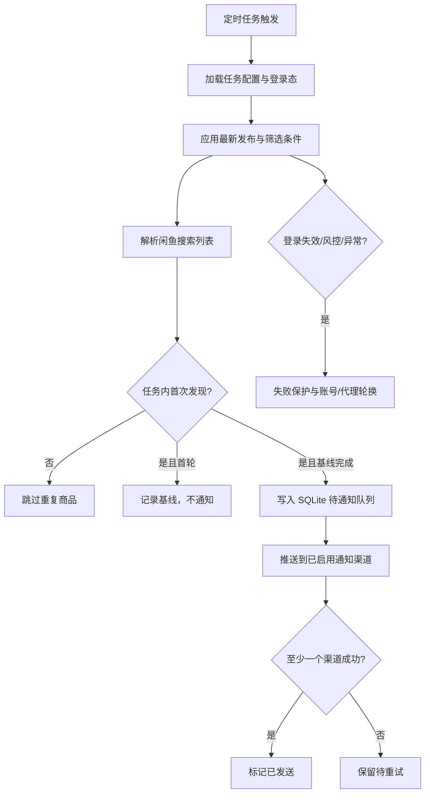

# 闲鱼新品监控与推送

[中文] ｜ [English](README_EN.md)

基于 Playwright 的轻量闲鱼定时监控器。按预设搜索与筛选条件扫描最新发布商品，通过 Web 管理任务、账号、通知和运行日志。

## 核心功能

- **新品监控**：按关键词、发布时间、价格、区域、包邮和个人闲置等条件搜索。
- **定时运行**：为任务配置 Cron，支持手动启动、停止和运行状态查看。
- **首次发现推送**：首轮完整扫描建立去重基线，后续只推送首次发现的符合条件商品。
- **可靠通知**：SQLite 持久去重与待发送队列；通知失败会在后续调度中重试。
- **登录与风控运维**：管理闲鱼登录态，保留账号/代理轮换、失败保护和日志。
- **多渠道通知**：支持 ntfy、企业微信、Bark、Telegram、Gotify 和 Webhook。
- **历史数据兼容**：保留旧结果与价格历史数据的读取入口；轻量新品采集不依赖这些历史分析功能。

## 截图


## 🐳 Docker 部署（推荐）

```bash
git clone https://github.com/Usagi-org/ai-goofish-monitor && cd ai-goofish-monitor
cp .env.example .env
vim .env # 填写相关配置项
docker compose up -d
docker compose logs -f app
docker compose down
```

如果镜像无法访问或下载速度慢，可尝试使用加速：
```bash

docker pull ghcr.nju.edu.cn/usagi-org/ai-goofish:latest
docker tag ghcr.nju.edu.cn/usagi-org/ai-goofish:latest ghcr.io/usagi-org/ai-goofish:latest
docker compose up -d

```

- 默认 Web UI 地址：`http://127.0.0.1:8000`
- Docker 镜像已内置 Chromium，无需宿主机额外安装浏览器。
- 官方镜像地址：`ghcr.io/usagi-org/ai-goofish:latest`
- 更新镜像：`docker compose pull && docker compose up -d`
- 如果你修改了 `.env` 中的 `SERVER_PORT`，请同步更新 `docker-compose.yaml` 里的端口映射。
- `docker-compose.yaml` 默认会把 SQLite 主库挂载到 `./data:/app/data`，数据库文件默认为 `data/app.sqlite3`
- 目前默认持久化这些目录：
    - `data/`  SQLite 主存储（任务、结果、价格历史）
    - `state/`  闲鱼登录状态文件
    - `logs/`  运行日志
    - `config.json`、`jsonl/`、`price_history/`  首次升级到 SQLite 时用于兼容导入的旧数据源

### 数据存储与迁移

- 当前在线主存储为 SQLite，默认路径 `data/app.sqlite3`
- 可通过环境变量 `APP_DATABASE_FILE` 自定义数据库路径；Docker 默认设置为 `/app/data/app.sqlite3`
- 应用启动时会自动建库建表，并尝试从旧的 `config.json`、`jsonl/`、`price_history/` 导入一次历史数据
- `state/`、`logs/` 仍然是文件系统目录，不在 SQLite 中
- 首次升级完成并确认 `data/app.sqlite3` 中数据正确后，可视部署方式决定是否继续保留旧的 `config.json`、`jsonl/`、`price_history/` 挂载

### 最少配置

- Web 登录：`WEB_USERNAME` / `WEB_PASSWORD`（默认 `admin/admin123`，建议部署时修改）。
- 通知渠道：至少配置一种，例如 `NTFY_TOPIC_URL`、`BARK_URL`、`WX_BOT_URL`、Telegram、Gotify 或 `WEBHOOK_URL`。
- 闲鱼登录态：在 Web UI 的账号管理中导入有效状态文件。
- `.env.example` 提供浏览器、通知、账号/代理轮换与失败保护配置。

不需要 AI API Key、OpenAI Base URL 或模型名称。


### 第一次使用

1. 打开默认 Web UI `http://127.0.0.1:8000` 并登录。
2. 进入“闲鱼账号管理”，使用 [Chrome 扩展](https://chromewebstore.google.com/detail/xianyu-login-state-extrac/eidlpfjiodpigmfcahkmlenhppfklcoa) 导出并粘贴闲鱼登录态 JSON。
3. 登录态文件会保存到 `state/` 目录，例如 `state/acc_1.json`。
4. 回到“任务管理”，创建任务并绑定账号后即可运行。

### 创建第一个监控任务

在任务管理中填写任务名称、搜索关键词和需要的筛选条件；如想优先看最新发布，可将“新发布”设为“最新”，并选择账号、配置 Cron。留空则不应用发布时间筛选。符合实际搜索/筛选条件且首次发现的商品会直接进入通知队列。首次完整扫描只建立基线，不推送已有商品。


## 用户使用说明

<details>
<summary>点击展开 Web UI 功能说明</summary>

### 任务管理

- 支持搜索关键词、价格、新发布范围、区域、包邮、个人闲置、账号绑定和定时规则。
- 符合搜索条件的商品会在每个任务首次发现时进入持久队列并推送；基线商品不推送。
- 区域筛选会显著缩小结果集，不需要时保持留空。

### 账号管理

- 支持导入、更新、删除闲鱼账号登录态。
- 每个任务可指定账号，也可不绑定并交给系统自动选择。

### 结果查看与运行日志

- 结果页和导出功能现在从 SQLite 查询，不再直接扫描 `jsonl` 文件。
- 日志页按任务展示运行过程，便于排查登录态失效、风控和通知问题。

### 系统设置

- 可查看系统状态、管理通知渠道、调整账号与代理轮换。

</details>


## 开发者开发

### 环境要求

- Python 3.10+
- Node.js + npm（本地验证 `Node v20.18.3` 可完成前端构建）
- Playwright CLI 与 Chromium，首次运行前建议执行 `python3 -m pip install playwright && python3 -m playwright install chromium`
- Chrome / Edge 浏览器（Linux 环境也可使用 Chromium；`start.sh` 会先检查浏览器是否存在）

```bash
git clone https://github.com/Usagi-org/ai-goofish-monitor
cd ai-goofish-monitor
cp .env.example .env
```

### 一键启动

```bash
chmod +x start.sh
./start.sh
```

`start.sh` 会先检查 Playwright CLI 和浏览器前置条件；在前置条件满足后自动安装项目依赖、构建前端、复制构建产物并启动后端。

### 手动启动

```bash
# 后端
python -m src.app
# 或
uvicorn src.app:app --host 0.0.0.0 --port 8000 --reload

# 前端
cd web-ui
npm install
npm run dev
```

- FastAPI 启动时会自动初始化 SQLite，并在首次启动时尝试导入旧的 `config.json/jsonl/price_history`
- `spider_v2.py` 默认从 SQLite 读取任务；只有显式传入 `--config <path>` 时才会走 JSON 配置兼容模式
- 默认数据库路径为 `data/app.sqlite3`
- Vite 开发服务器会将 `/api`、`/auth`、`/ws` 代理到 `http://127.0.0.1:8000`。
- `npm run build` 先生成 `web-ui/dist/`，`start.sh` 再复制到仓库根目录 `dist/`。
- FastAPI 负责提供根目录 `dist/index.html` 和 `dist/assets/`。
- `./start.sh` 默认输出访问地址 `http://localhost:8000` 和 API 文档 `http://localhost:8000/docs`。

### 测试与校验

```bash
PYTEST_DISABLE_PLUGIN_AUTOLOAD=1 pytest
cd web-ui && npm run build
```

## 配置说明

<details>
<summary>点击展开常用配置项</summary>

### 运行时

- `RUN_HEADLESS`：是否以无头模式运行爬虫；Docker 中应保持 `true`。
- `SERVER_PORT`：后端监听端口，默认 `8000`。
- `LOGIN_IS_EDGE`：本地环境可切换为 Edge 内核；Docker 镜像未内置 Edge，容器内会固定使用 Chromium。
- `PCURL_TO_MOBILE`：是否将 PC 商品链接转换为移动端链接。

### 通知

- `NTFY_TOPIC_URL`
- `GOTIFY_URL` / `GOTIFY_TOKEN`
- `BARK_URL`
- `WX_BOT_URL`
- `TELEGRAM_BOT_TOKEN` / `TELEGRAM_CHAT_ID` / `TELEGRAM_API_BASE_URL`
- `WEBHOOK_*`

### 代理轮换与失败保护

- `PROXY_ROTATION_ENABLED`
- `PROXY_ROTATION_MODE`
- `PROXY_POOL`
- `PROXY_ROTATION_RETRY_LIMIT`
- `PROXY_BLACKLIST_TTL`
- `TASK_FAILURE_THRESHOLD`
- `TASK_FAILURE_PAUSE_SECONDS`
- `TASK_FAILURE_GUARD_PATH`

完整示例见 `.env.example`。

</details>

## Web 界面认证

<details>
<summary>点击展开认证说明</summary>

- Web UI 当前使用登录页收集账号密码，并通过 `POST /auth/status` 校验。
- 登录成功后，前端会在浏览器本地保存登录状态，用于路由守卫和 WebSocket 初始化。
- 默认账号密码为 `admin/admin123`，生产环境请务必修改。

</details>

## 🚀 工作流程

主服务 `src.app` 根据手动操作或 Cron 调度启动任务进程。轻量采集流程如下：




## 常见问题

<details>
<summary>点击展开常见问题</summary>

### 首次运行为什么没有商品通知？

首次完整扫描会建立去重基线，不推送搜索列表中已有的商品。后续扫描只会通知该任务首次发现的符合筛选条件商品。若首次扫描中断，基线会保持未完成，下一次运行继续建立。

### 区域筛选为什么默认建议留空？

区域筛选会显著减少搜索结果，适合明确只看某个区域的场景。若你先验证整体市场，建议先不填。

### 本地页面打开后提示前端构建产物不存在？

说明根目录 `dist/` 缺失。可直接执行 `./start.sh`，或先在 `web-ui/` 里执行 `npm run build`，再确认构建产物已复制到仓库根目录。

### `./start.sh` 为什么提示缺少 Playwright 或浏览器？

这是脚本的前置检查。请先安装 Playwright CLI 与 Chromium，并确保系统中可用 Chrome / Edge（Linux 环境也可用 Chromium），然后重新执行 `./start.sh`。

</details>


## 致谢

<details>
<summary>点击展开致谢内容</summary>

本项目在开发过程中参考了以下优秀项目，特此感谢：

- [superboyyy/xianyu_spider](https://github.com/superboyyy/xianyu_spider)

以及感谢LinuxDo相关人员的脚本贡献

- [@jooooody](https://linux.do/u/jooooody/summary)

以及感谢 [LinuxDo](https://linux.do/) 社区。

以及感谢 ClaudeCode/Gemini/Codex 等模型工具，解放双手 体验Vibe Coding的快乐。

</details>


## 注意事项

<details>
<summary>点击展开注意事项详情</summary>

- 请遵守闲鱼的用户协议和robots.txt规则，不要进行过于频繁的请求，以免对服务器造成负担或导致账号被限制。
- 本项目仅供学习和技术研究使用，请勿用于非法用途。
- 本项目采用 [MIT 许可证](LICENSE) 发布，按"现状"提供，不提供任何形式的担保。
- 项目作者及贡献者不对因使用本软件而导致的任何直接、间接、附带或特殊的损害或损失承担责任。
- 如需了解更多详细信息，请查看 [免责声明](DISCLAIMER.md) 文件。

</details>

## Star History

[](https://www.star-history.com/#Usagi-org/ai-goofish-monitor&Date)


