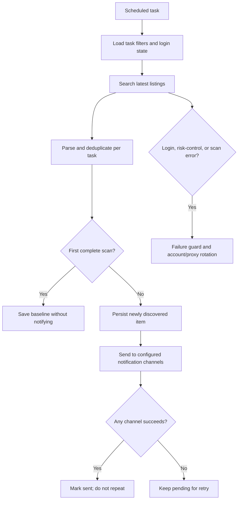

# Xianyu New-Item Monitor

[中文](README.md) ｜ [English]

A lightweight Playwright monitor for scheduled Xianyu (闲鱼) searches. Configure search filters in the Web UI and receive notifications for matching items first discovered by each task.

## Core Features

- **Scheduled search**: Configure keywords, optional publish-time filter (choose `Latest` to prioritize newest listings), price, region, personal listings, shipping, page count, and Cron schedule.
- **New-item notifications**: The first complete scan establishes a baseline without sending existing listings; later scans notify newly discovered matching items.
- **Persistent deduplication and retry**: SQLite keeps task/item keys and pending notifications across restarts; failed sends remain retryable.
- **Operations and risk controls**: Manage login states, account/proxy rotation, failure guard, process logs, and graceful task shutdown.
- **Multiple notification channels**: ntfy.sh, WeChat Work (企业微信), Bark, Telegram, Gotify, and Webhook.
- **Web management and Docker deployment**: Configure tasks, schedules, accounts, notifications, and system status in the UI.

## Screenshots


## Quick Start

### Requirements

- Python 3.10+
- Node.js + npm (`Node v20.18.3` has been verified to complete the frontend build)
- Playwright CLI and Chromium. Before the first local run, install them with `python3 -m pip install playwright && python3 -m playwright install chromium`
- Chrome or Edge on desktop systems. On Linux, Chromium also works. `start.sh` checks this prerequisite before continuing

```bash
git clone https://github.com/Usagi-org/ai-goofish-monitor
cd ai-goofish-monitor
cp .env.example .env
```

### Minimum Configuration

| Variable | Description | Required |
|----------|-------------|----------|
| `WEB_USERNAME` / `WEB_PASSWORD` | Web UI login credentials, default `admin/admin123` | No |
| Notification channel | Configure at least one channel in `.env` or Web Settings | Yes |

See "Configuration" below for the rest.

### Start Locally

```bash
chmod +x start.sh
./start.sh
```

`start.sh` first validates the Playwright CLI and browser prerequisites. Once they are available, it installs project dependencies, builds the frontend, copies the artifacts, and starts the backend.

### First-Time Setup

1. Open the default Web UI at `http://127.0.0.1:8000` and sign in.
2. Go to "Xianyu Account Management" and use the [Chrome Extension](https://chromewebstore.google.com/detail/xianyu-login-state-extrac/eidlpfjiodpigmfcahkmlenhppfklcoa) to export and paste the Xianyu login-state JSON.
3. Login-state files are stored in `state/`, for example `state/acc_1.json`.
4. Go back to "Task Management", create a task, bind an account if needed, and run it.

### Create Your First Monitor

In Task Management, set a task name, search keyword, desired filters, account, and Cron schedule. Select `Latest` in the new-publish filter to prioritize newest listings; leave it empty to skip that time filter. Matching items are persisted and notified the first time the task discovers them. The first complete scan creates a baseline and does not notify items already in the results.

## 🐳 Docker Deployment (Recommended)

```bash
git clone https://github.com/Usagi-org/ai-goofish-monitor && cd ai-goofish-monitor
cp .env.example .env
vim .env # fill in the required values
docker compose up -d
docker compose logs -f app
docker compose down
```

- Default Web UI: `http://127.0.0.1:8000`
- The published Docker image already includes Chromium, so no extra browser install is required on the host.
- Update image: `docker compose pull && docker compose up -d`
- If you change `SERVER_PORT` in `.env`, update the `ports` mapping in `docker-compose.yaml` as well.
- `docker-compose.yaml` now mounts the primary SQLite database directory as `./data:/app/data`, with the default database file at `data/app.sqlite3`
- These paths are persisted by default:
  - `data/` for the SQLite primary store (tasks, results, price history)
  - `state/` for login-state cookie files
  - `prompts/` for task prompt files
  - `logs/` for runtime logs
  - `images/` for downloaded product images and per-task temporary image folders
  - `config.json`, `jsonl/`, and `price_history/` as legacy sources for the first SQLite migration

### Storage and Migration

- SQLite is now the online primary storage, with the default path `data/app.sqlite3`
- You can override the database path with `APP_DATABASE_FILE`; Docker sets it to `/app/data/app.sqlite3`
- On startup, the app initializes the schema and tries to import existing data once from legacy `config.json`, `jsonl/`, and `price_history/`
- `state/`, `prompts/`, `logs/`, and `images/` remain filesystem-based and are not stored in SQLite
- Product images are temporarily downloaded to `images/task_images_<task_name>/` and are normally cleaned up when the task finishes
- After the first upgrade and after verifying the database contents in `data/app.sqlite3`, you can decide whether to keep the legacy `config.json`, `jsonl/`, and `price_history/` mounts

## User Guide

<details>
<summary>Click to expand Web UI usage notes</summary>

### Task Management

- Configure search keywords, price, latest-publish range, region, personal listings, free shipping, account binding, page depth, and cron schedule.
- Every first-discovered item matching the configured Xianyu search filters is queued for notification; no recommendation or keyword-rule stage is applied.
- Region filtering narrows the search, so leave it blank when you want broader coverage.

### Account Management

- Import, update, and delete Xianyu login states.
- Each task can bind a specific account or leave account selection to the system.

### Results and Logs

- The results page and export endpoints now query SQLite instead of directly scanning `jsonl` files.
- The logs page is the first place to inspect login-state expiry, anti-bot issues, or notification delivery failures.

### System Settings

- View system status, configure notification channels, and adjust account / proxy rotation settings.

</details>

## Developer Guide

### Local Development

```bash
# backend
python -m src.app
# or
uvicorn src.app:app --host 0.0.0.0 --port 8000 --reload

# frontend
cd web-ui
npm install
npm run dev
```

- FastAPI initializes SQLite on startup and performs the one-time legacy import from `config.json/jsonl/price_history` when needed
- `spider_v2.py` now loads tasks from SQLite by default; JSON config is only used when `--config <path>` is passed explicitly
- The default local database path is `data/app.sqlite3`
- The Vite dev server proxies `/api`, `/auth`, and `/ws` to `http://127.0.0.1:8000`.
- `npm run build` writes `web-ui/dist/`, and `start.sh` copies it to the repository root `dist/`.
- FastAPI serves `dist/index.html` and `dist/assets/` from the repository root.
- `./start.sh` prints the default app URL `http://localhost:8000` and API docs URL `http://localhost:8000/docs`.

### Validation

```bash
PYTEST_DISABLE_PLUGIN_AUTOLOAD=1 pytest
cd web-ui && npm run build
```

## Configuration

<details>
<summary>Click to expand common configuration items</summary>

### Runtime

- `RUN_HEADLESS`: whether the scraper runs headless; keep it `true` in Docker.
- `SERVER_PORT`: backend port, default `8000`.
- `LOGIN_IS_EDGE`: use Edge instead of Chrome locally; Docker images do not bundle Edge and always run with Chromium.
- `PCURL_TO_MOBILE`: convert desktop item URLs to mobile URLs.

### Notifications

- `NTFY_TOPIC_URL`
- `GOTIFY_URL` / `GOTIFY_TOKEN`
- `BARK_URL`
- `WX_BOT_URL`
- `TELEGRAM_BOT_TOKEN` / `TELEGRAM_CHAT_ID` / `TELEGRAM_API_BASE_URL`
- `WEBHOOK_*`

### Proxy Rotation and Failure Guard

- `PROXY_ROTATION_ENABLED`
- `PROXY_ROTATION_MODE`
- `PROXY_POOL`
- `PROXY_ROTATION_RETRY_LIMIT`
- `PROXY_BLACKLIST_TTL`
- `TASK_FAILURE_THRESHOLD`
- `TASK_FAILURE_PAUSE_SECONDS`
- `TASK_FAILURE_GUARD_PATH`

See `.env.example` for the full list.

</details>

## Web Authentication

<details>
<summary>Click to expand authentication notes</summary>

- The Web UI uses a login page and validates credentials through `POST /auth/status`.
- After login, the frontend stores local auth state for route guards and WebSocket startup.
- The default credentials are `admin/admin123`; change them in production.

</details>

## 🚀 Workflow

The FastAPI app starts enabled Cron jobs. Each job searches Xianyu with its configured filters, persists first-seen item keys in SQLite, and delivers queued notifications.



## FAQ

<details>
<summary>Click to expand FAQ</summary>

### Why are there no notifications on the first run?

The first complete scan records the current listings as a baseline and does not notify for items already present. Later scans notify items first discovered by that task. An incomplete scan does not finalize the baseline.

### Why is the region filter optional by default?

Region filtering can sharply reduce result volume. Leave it empty if you want a broader market scan first.

### Why does the app say the frontend build artifacts are missing?

It means the repository root `dist/` directory is missing. Run `./start.sh`, or build the frontend in `web-ui/` and make sure the artifacts are copied to the root `dist/`.

### Why does `./start.sh` complain about missing Playwright or a browser?

The script performs a prerequisite check before installing project dependencies. Install the Playwright CLI and Chromium first, then make sure Chrome, Edge, or Chromium is available on the system and rerun `./start.sh`.

</details>

## Acknowledgments

<details>
<summary>Click to expand acknowledgments</summary>

This project referenced the following excellent projects during development. Special thanks to:

- [superboyyy/xianyu_spider](https://github.com/superboyyy/xianyu_spider)

Also thanks to LinuxDo contributors for script contributions:

- [@jooooody](https://linux.do/u/jooooody/summary)

And thanks to the [LinuxDo](https://linux.do/) community.

Also thanks to ClaudeCode/Gemini/Codex and other model tools for freeing our hands and experiencing the joy of Vibe Coding.

</details>


## Notices

<details>
<summary>Click to expand notice details</summary>

- Please comply with Xianyu's user agreement and robots.txt rules. Do not make frequent requests to avoid burdening the server or having your account restricted.
- This project is for learning and technical research purposes only. Do not use it for illegal purposes.
- This project is released under the [MIT License](LICENSE), provided "as is", without any form of warranty.
- The project authors and contributors are not responsible for any direct, indirect, incidental, or special damages or losses caused by the use of this software.
- For more details, please refer to the [Disclaimer](DISCLAIMER.md) file.

</details>

## Star History

[](https://www.star-history.com/#Usagi-org/ai-goofish-monitor&Date)
